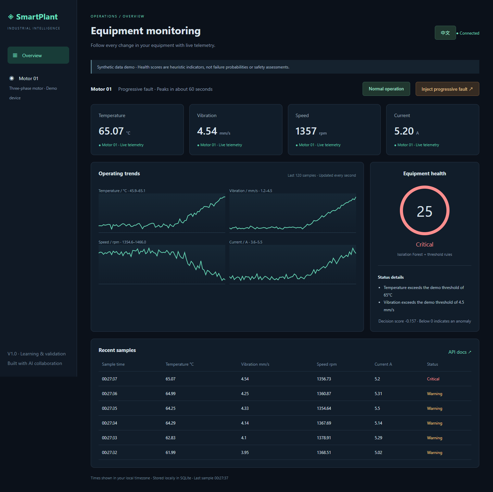
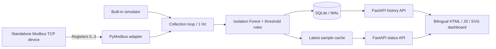

# SmartPlant Monitor

[中文](README.md) | **English**

Industrial equipment monitoring and anomaly detection, built with AI collaboration for automation engineering practice.

Simulate motor temperature, vibration, speed, and current; collect data, persist it in SQLite, and visualize anomalies detected with Isolation Forest and demonstration thresholds. No physical hardware is required. A standalone Modbus TCP simulator and client are included.

## Quick start

Python 3.13 is recommended; 3.12 is supported. Clone or download the repository and open a terminal in its directory:

```sh
git clone https://github.com/IISophieII/smartplant-monitor.git
cd smartplant-monitor
```

Windows PowerShell:

```powershell
python -m venv .venv
.\.venv\Scripts\python.exe -m pip install -e '.[dev]'
.\.venv\Scripts\python.exe -m uvicorn smartplant.app:app --host 127.0.0.1 --port 8000
```

Alternatively run `./Start-SmartPlant.ps1`, which creates the environment and installs dependencies. When Python is missing from PATH, this launcher attempts to use a bundled Codex runtime if available.

macOS / Linux:

```sh
python3 -m venv .venv
. .venv/bin/activate
pip install -e '.[dev]'
uvicorn smartplant.app:app --host 127.0.0.1 --port 8000
```

Open [the dashboard](http://127.0.0.1:8000). Select **English** or **中文** at the top of the page; your choice is remembered in this browser. The initial language follows your browser preference. API documentation is at `/docs`. Press Ctrl+C in the terminal to stop the server.

Use a single Uvicorn worker: each worker starts its own collector. Startup trains a fixed-seed synthetic baseline, then collects approximately one sample per second.

## Try the demo

1. Watch **Normal operation** for about 20 seconds.
2. Click **Inject progressive fault**. Readings deteriorate over about 60 seconds, producing model warnings and threshold violations.
3. Click **Normal operation** to restore normal readings. The charts retain the fault episode.
4. Inspect `/api/history?limit=120`. Stored history survives restarts.



## Architecture



The frontend uses native SVG charts, without CDN or build dependencies. After installation, the demo runs offline. Status and history are polled once per second.

| Module | Responsibility |
|---|---|
| `smartplant/app.py` | Application lifecycle, collector, API |
| `smartplant/simulator.py` | Normal and progressive-fault telemetry |
| `smartplant/modbus.py` | TCP device server and client adapter |
| `smartplant/detection.py` | Anomaly detection and health scoring |
| `smartplant/storage.py` | SQLite persistence and retention |
| `smartplant/static/` | Dashboard, language switching, styles, charts |
| `tests/` | Model, persistence, API, and TCP integration tests |

## Modbus TCP

Activate the virtual environment in both terminals: `.\.venv\Scripts\Activate.ps1` on Windows or `. .venv/bin/activate` on macOS/Linux.

Start the device in the first terminal:

```sh
python -m smartplant.modbus
```

Start the monitor in a second PowerShell terminal:

```powershell
$env:DATA_SOURCE='modbus'
$env:MODBUS_HOST='127.0.0.1'
python -m uvicorn smartplant.app:app --host 127.0.0.1 --port 8000
```

macOS/Linux equivalent:

```sh
DATA_SOURCE=modbus MODBUS_HOST=127.0.0.1 python -m uvicorn smartplant.app:app --host 127.0.0.1 --port 8000
```

Default port: 5020. Set `MODBUS_PORT` in both processes to change it. Set `SIMULATION_MODE=progressive_fault` before starting the device to inject a fault. Dashboard mode controls are disabled for external Modbus sources. Failed reads display an error, retain the last successful sample, and retry.

| Holding register (zero-based) | Reading | Encoding |
|---|---|---|
| 0 | Temperature °C | uint16 / 100 |
| 1 | Vibration mm/s | uint16 / 100 |
| 2 | Speed rpm | uint16 |
| 3 | Current A | uint16 / 100 |

Device ID: 1. Function code: 03. Negative temperatures, write control, and other register layouts are not supported. See the [PyModbus client documentation](https://pymodbus.readthedocs.io/en/v3.11.0/source/client.html).

## Docker Compose

```sh
docker compose up --build
```

For the full Modbus chain in PowerShell:

```powershell
$env:DATA_SOURCE='modbus'
docker compose --profile modbus up --build
```

macOS/Linux: `DATA_SOURCE=modbus docker compose --profile modbus up --build`.

SQLite uses a persistent named volume. The dashboard port binds to localhost. This is a trusted local demo without authentication; add authentication and access controls before exposing it publicly. Docker files are provided but have not been executed locally.

## API and storage

| Method | Endpoint | Purpose |
|---|---|---|
| GET | `/api/health` | Service status, collection error, sample readiness |
| GET | `/api/status` | Latest successful sample, source, mode, collection error |
| GET | `/api/history?limit=120` | Latest N samples, chronological order; N = 1..3600 |
| POST | `/api/simulation` | `{"mode":"normal"}` or `{"mode":"progressive_fault"}` |

API identifiers are language-neutral; explanation/error text is English. The dashboard translates those messages for Chinese users. Timestamps use UTC in storage and local time in the dashboard. SQLite retains 86,400 samples (roughly a day at 1 Hz). Set `DATABASE_PATH` to override `data/smartplant.db`. V1 does not include time-range queries, alarm acknowledgement, or MQTT.

## Detection limitations

Isolation Forest trains on 1,500 synthetic normal samples with fixed seeds and `contamination=0.02`. A negative decision score indicates an anomaly. Health is `100 × (1 - clip(-margin / 0.25, 0, 1))`. Temperature above 65°C, vibration above 4.5 mm/s, or current above 5.5 A triggers Critical status and caps health at 25. Thresholds are demonstration settings, not industry standards.

Synthetic faults intentionally differ from training data; passing these tests does not establish real-world accuracy. Health is not failure probability. Normal data can occasionally trigger warnings. Real fault labels, false-alarm evaluation, operating-condition normalization, temporal features, and remaining-life prediction are not implemented. Future validation needs independent real data split by device and time.

## Tests

```sh
pip install -e '.[dev]'
ruff check .
pytest -q
```

Tests cover fault progression/recovery, persistence, API validation, failed and recovered collection, mode-control restrictions, and actual TCP reads. GitHub Actions checks Python 3.12 and 3.13. See [validation notes](docs/VALIDATION.en.md).

`requirements-lock.txt` captures the original Windows/Python 3.12 validation dependencies. Install it before the project to reproduce that environment. Other environments still require independent checks.

## Roadmap

- V2: MQTT, multiple devices, alarm acknowledgement, time-range queries, optional InfluxDB.
- V3: Real sensors/PLCs, rolling-window features, FFT, model versioning, evaluation by operating condition.

The source `sample()` interface, detector, and storage module provide extension boundaries. These roadmap items are not current features.

## AI collaboration and portfolio use

The owner defined requirements and demonstration goals. Code, documentation, and automated tests were produced and iterated with AI assistance. Describe your actual contribution after personally running, understanding, and validating the project; do not claim independent authorship of all code.

After completing those activities, adapt this example to your involvement:

> Planned and developed an industrial equipment monitoring demo with AI assistance, using FastAPI, Modbus TCP, SQLite, and Isolation Forest for simulated motor telemetry, historical queries, and anomaly visualization. Participated in fault-injection testing, result validation, and technical documentation.

Be ready to explain register scaling, collection failures, training/test differences, score limitations, and single-process deployment.
