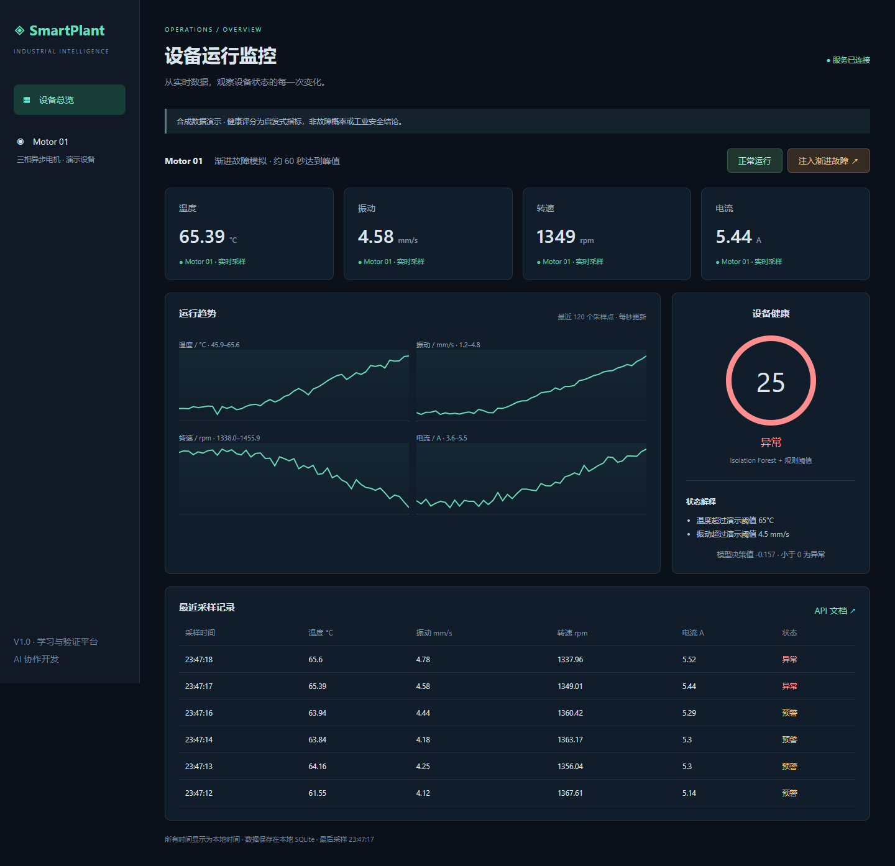

# SmartPlant Monitor

工业设备智能监控与异常检测平台 · V1

面向自动化专业的软件工程实践项目：模拟工业电机的温度、振动、转速、电流，完成采集、持久化、异常检测和网页展示。无需 PLC 或传感器即可运行，也可通过真实 Modbus TCP 协议连接独立模拟设备。

## 快速启动

建议 Python 3.13，兼容 3.12。Windows PowerShell：

也可以直接运行 `./Start-SmartPlant.ps1`，脚本自动创建虚拟环境并安装依赖；若系统没有 Python，会尝试使用 Codex 自带运行环境。

```powershell
python -m venv .venv
.\.venv\Scripts\python.exe -m pip install -e '.[dev]'
.\.venv\Scripts\python.exe -m uvicorn smartplant.app:app --host 127.0.0.1 --port 8000
```

macOS / Linux：

```sh
python3 -m venv .venv
. .venv/bin/activate
pip install -e '.[dev]'
uvicorn smartplant.app:app --host 127.0.0.1 --port 8000
```

打开 http://127.0.0.1:8000，API 文档在 `/docs`。首次启动训练固定种子的合成正常基线，然后每秒采样。不要使用多个 Uvicorn worker，否则每个进程都会启动采集器。

## 3 分钟演示

1. 保持正常模式约 20 秒，观察四项指标和健康评分。
2. 点击「注入渐进故障」，指标在约 60 秒内逐渐恶化；模型预警和规则阈值异常分别显示解释。
3. 点击「正常运行」，新数据恢复正常分布，趋势图保留之前的故障过程。
4. 打开 `/api/history?limit=120` 查看落库数据，重启后历史仍保留。

实际运行截图（故障注入场景）：



## 架构


前端使用原生 SVG 曲线，无 CDN 或构建依赖，支持离线演示。状态和历史每秒轮询一次。

```text
smartplant/
  app.py          生命周期、采集编排与 API
  simulator.py    可复现的正常/渐进故障数据
  modbus.py       TCP 设备服务端和采集适配器
  detection.py    模型与健康评分
  storage.py      SQLite 持久化与保留策略
  static/         网页、样式、趋势图
tests/            模型、存储、API、真实 TCP 集成测试
.github/workflows/ci.yml
Dockerfile / compose.yaml
```

## Modbus TCP 模式

在第一个终端启动 `python -m smartplant.modbus`，默认端口 5020。在第二个 PowerShell 终端：

```powershell
$env:DATA_SOURCE='modbus'
$env:MODBUS_HOST='127.0.0.1'
python -m uvicorn smartplant.app:app --host 127.0.0.1 --port 8000
```

使用虚拟环境中的 Python，或先激活虚拟环境。若要模拟 Modbus 故障，在设备进程启动前设置 `SIMULATION_MODE=progressive_fault`。Modbus 模式的网页模式按钮禁用，避免误以为它会控制真实设备。读取失败保留最后一次成功数据，并显式提示采集异常；下一轮重试。

| Holding register（零基地址） | 字段 | 编码 |
|---|---|---|
| 0 | 温度 °C | uint16 / 100 |
| 1 | 振动 mm/s | uint16 / 100 |
| 2 | 转速 rpm | uint16 |
| 3 | 电流 A | uint16 / 100 |

Device ID = 1，功能码 03。本示例不支持负温度、写控制或其他设备的寄存器布局。PyModbus API 参考：[3.11 官方客户端文档](https://pymodbus.readthedocs.io/en/v3.11.0/source/client.html)。

## Docker Compose

```sh
docker compose up --build
```

Modbus 完整链路（PowerShell）：

```powershell
$env:DATA_SOURCE='modbus'
docker compose --profile modbus up --build
```

SQLite 使用命名卷持久化，默认仅将网页端口绑定到本机。当前无登录认证，仅用于可信本地演示，若对外部署须先增加鉴权及访问控制。

## API

| 方法 | 路径 | 说明 |
|---|---|---|
| GET | `/api/health` | 服务状态、采集错误与是否已有数据 |
| GET | `/api/status` | 最近成功采样、数据源、模式、采集错误 |
| GET | `/api/history?limit=120` | 最近 N 条，时间正序；N 为 1..3600 |
| POST | `/api/simulation` | `{"mode":"normal"}` 或 `{"mode":"progressive_fault"}` |

时间存储为 UTC，网页转为本地时间。SQLite 最多保留 86,400 个采样点（1 Hz 约一天），V1 不实现时间范围查询、告警确认或 MQTT。

## 模型与评分边界

Isolation Forest 使用 1,500 条合成正常样本训练，随机种子固定，contamination=0.02。决策值小于 0 视为偏离基线；健康分是 `100 × (1 - clip(-margin / 0.25, 0, 1))`。温度 >65°C、振动 >4.5 mm/s 或电流 >5.5 A 时标为异常且健康分不高于 25。阈值仅为演示设定，并非行业标准。

合成故障数据有意偏离训练分布，因此测试成功不能证明真实设备检测准确率。当前没有真实故障标签、误报率评估、工况归一化、时序特征或剩余寿命预测。健康分不是故障概率，正常模式也可能出现少量模型预警。后续应使用独立真实数据进行按设备/时间划分的验证。

## 测试

```sh
pip install -e '.[dev]'
ruff check .
pytest -q
```

测试包含正常基线、渐进故障与恢复、SQLite 重开持久化、API 参数校验、采集失败降级、Modbus 模式控制拒绝及实际 TCP 寄存器往返。GitHub Actions 配置覆盖 Python 3.12/3.13。实际运行记录见 `docs/VALIDATION.md`。

`requirements-lock.txt` 保存本次 Windows / Python 3.12 验证环境的完整依赖版本；如需复现可先 `pip install -r requirements-lock.txt` 再安装项目。跨平台/3.13 仍需执行 CI 验证。

## 后续路线

- V2：MQTT 适配器、多设备配置、告警确认、时间范围查询、InfluxDB 可选存储。
- V3：真实传感器/PLC、滑动窗口特征、FFT、模型版本管理、分工况评估。

通过 `sample()` 采集接口、独立检测器和存储模块保持扩展边界，不宣称未实现功能。

## 协作与简历表述

本项目由用户提出需求与展示目标，使用 AI 协作生成和迭代代码、文档及自动化测试。用户应在亲自运行、理解与验证后，根据实际参与范围描述贡献，不声称独立编写全部代码。

完成亲自验证后可参考：

> 规划并通过 AI 协作开发工业设备监控演示平台，使用 FastAPI、Modbus TCP、SQLite 和 Isolation Forest 实现模拟电机数据采集、历史查询与异常展示；参与故障注入测试、结果验证和技术文档整理。

面试前应能解释寄存器缩放、采集失败处理、训练/测试数据差异、健康分局限与单进程部署约束。
